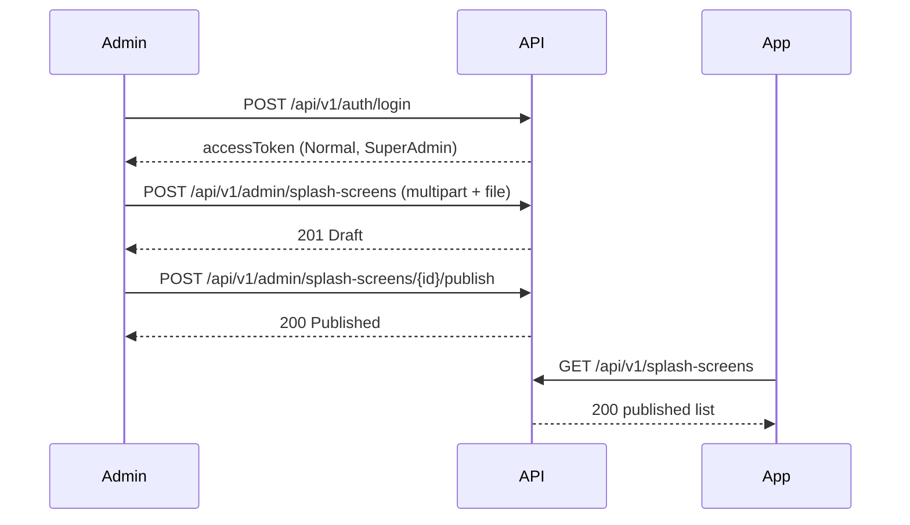

# Admin splash screens

CMS for the **shared** app splash (all four app roles see the same published list).

**Base:** `/api/v1/admin/splash-screens`  
**Policy:** `CmsContent`  
Requires a **normal** JWT (`access_type` = `Normal`) and `account_type` of `SuperAdmin` or `ContentAdmin`.  
Support Admin, Family, Medical, Companion, Elderly, and restricted verification tokens receive **403**. Missing/invalid token → **401**.

Login first with `POST /api/v1/auth/login` using the seeded Super Admin, then send `Authorization: Bearer <accessToken>`.

## Lifecycle

```text
Create → Draft
Publish → Published (visible on GET /api/v1/splash-screens)
Unpublish → Draft (hidden from public GET)
Delete → row removed
```

`internalName` is unique and immutable after create.

## Create

`POST /api/v1/admin/splash-screens` → `201`  
`Content-Type: multipart/form-data`  
Image is uploaded **in the same request**. There is no `imagePath` field and no separate files endpoint.

Form fields:

| Field | Required | Notes |
|---|---|---|
| `internalName` | yes | Unique, immutable after create |
| `arabicTitle` | yes | |
| `englishTitle` | yes | |
| `arabicDescription` | yes | |
| `englishDescription` | yes | |
| `arabicButtonText` | yes | |
| `englishButtonText` | yes | |
| `backgroundColor` | yes | `#RRGGBB` |
| `displayOrder` | yes | integer >= 0 |
| `file` | yes | `image/jpeg`, `image/png`, or `image/webp`. Max 2 MB |

The API stores the file on disk and persists a generated key such as `splash/{guid}.jpg`. The client file name is never used in the path.

Duplicate `internalName` → `409` `Cms.Splash.InternalNameAlreadyInUse`.

Missing/empty file → `400` `Storage.File.Empty`.  
Too large → `400` `Storage.File.TooLarge`.  
Wrong type (for example GIF) → `400` `Storage.File.UnsupportedType`.

Response includes `status`: `1` Draft, `2` Published. `id` is `{ "value": "<guid>" }`. `imagePath` in the response is the server key, not a laptop path.

Public image URL:

```text
{baseUrl}/files/{imagePath}

## Publish / unpublish

```text
POST /api/v1/admin/splash-screens/{id}/publish     → 200
POST /api/v1/admin/splash-screens/{id}/unpublish   → 200
```

Idempotent at Domain level (already published / already draft is a no-op success).

## Delete

`DELETE /api/v1/admin/splash-screens/{id}` → `204`  
Hard delete. Missing id → `404`.

## Public read (no admin token)

Apps call `GET /api/v1/splash-screens`. See `docs/app/public/splash-screens.md`.

## Sequence


