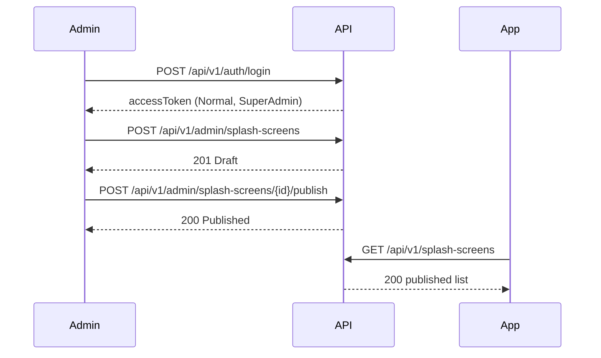

# Admin splash screens

CMS for the **shared** app splash (all four app roles see the same published list).

**Base:** `/api/v1/admin/splash-screens`  
**Policy:** `CmsContent`  
Requires a **normal** JWT (`access_type` = `Normal`) and `account_type` of `SuperAdmin` or `ContentAdmin`.  
Support Admin, Family, Medical, Companion, Elderly, and restricted verification tokens receive **403**. Missing/invalid token → **401**.

Login first with `POST /api/v1/auth/login` using the seeded Super Admin, then send `Authorization: Bearer <accessToken>`.

## Lifecycle

```text
Create → Draft
Publish → Published (visible on GET /api/v1/splash-screens)
Unpublish → Draft (hidden from public GET)
Delete → row removed
```

`internalName` is unique and immutable after create.

## Create

`POST /api/v1/admin/splash-screens` → `201`

```json
{
  "internalName": "welcome",
  "arabicTitle": "مرحبا",
  "englishTitle": "Welcome",
  "arabicDescription": "وصف قصير",
  "englishDescription": "Short description",
  "arabicButtonText": "التالي",
  "englishButtonText": "Next",
  "imagePath": "splash/welcome.png",
  "backgroundColor": "#1A73E8",
  "displayOrder": 0
}
```

`backgroundColor` must match `#RRGGBB`. `displayOrder` >= 0. `imagePath` is a key (max 500), not a local disk path.

Duplicate `internalName` → `409` `Cms.Splash.InternalNameAlreadyInUse`.

Response includes `status`: `1` Draft, `2` Published. `id` is `{ "value": "<guid>" }`.

## Update content

`PUT /api/v1/admin/splash-screens/{id}` → `200`  
`id` is the raw GUID (not the `{ value }` object).

Does not change `internalName`. Missing id → `404` `Cms.Splash.NotFound`.

## Publish / unpublish

```text
POST /api/v1/admin/splash-screens/{id}/publish     → 200
POST /api/v1/admin/splash-screens/{id}/unpublish   → 200
```

Idempotent at Domain level (already published / already draft is a no-op success).

## Delete

`DELETE /api/v1/admin/splash-screens/{id}` → `204`  
Hard delete. Missing id → `404`.

## Public read (no admin token)

Apps call `GET /api/v1/splash-screens`. See `docs/users/splash-screens.md`.

## Sequence


