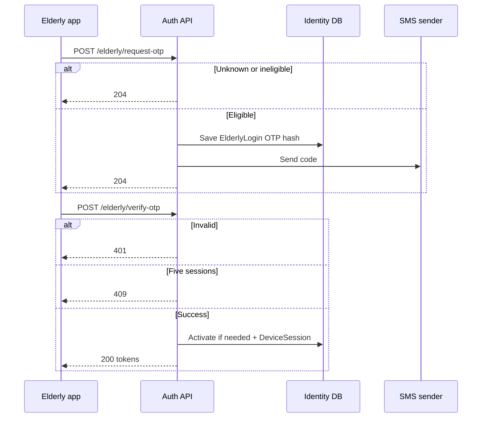

# Elderly SMS login

Elderly login is phone + SMS OTP only.

No password. No required email. Unknown numbers cannot self-register.

Development base URL:

```text
https://localhost:7296
```

If SMS Misr is not configured, `POST /elderly/request-otp` still returns `204` and stores a hash. No SMS is sent.

## Flow

```text
Family creates the Elderly user
    ↓
POST /api/v1/auth/elderly/request-otp
    ↓
POST /api/v1/auth/elderly/verify-otp
    ↓
Normal access + refresh + DeviceSession
```



## POST `/api/v1/auth/elderly/request-otp`

Anonymous. Success `204`. No response body.

```bash
curl -sS -o /dev/null -w "%{http_code}\n" \
  https://localhost:7296/api/v1/auth/elderly/request-otp \
  -H "Content-Type: application/json" \
  -d '{
    "phoneNumber": "+201001234567"
  }'
```

Phone must be exact ASCII E.164: `+[1-9][0-9]{1,14}`.

Rules:

- Always `204` for unknown, ineligible, and eligible phones
- Eligible: Elderly-only user in `PendingVerification` or `Active`
- 60-second silent cooldown
- At 60 seconds the previous pending request is replaced
- Family must create/link the Elderly user first

## POST `/api/v1/auth/elderly/verify-otp`

Anonymous. Success `200`. Same response shape as email/password login.

```bash
curl -sS https://localhost:7296/api/v1/auth/elderly/verify-otp \
  -H "Content-Type: application/json" \
  -d '{
    "phoneNumber": "+201001234567",
    "code": "123456",
    "deviceName": "iPhone",
    "devicePlatform": 2,
    "appVersion": "1.0.0"
  }'
```

`code` must be exactly six ASCII digits.

Rules:

- First valid OTP verifies the phone and activates a PendingVerification Elderly user
- Session-limit check runs before the OTP is consumed
- If the limit is reached, the OTP request stays Pending
- Successful Elderly login is always Normal access
- An Elderly user cannot have another account type on the same identity
- Invalid, expired, unknown, and ineligible attempts use one generic error

| HTTP | `code` |
|---|---|
| 401 | `Identity.ElderlyLogin.OtpVerificationFailed` |
| 409 | `Identity.ElderlyLogin.SessionLimitReached` |

## Local SMS

For a test sender, do **not** set a template:

```bash
export Identity__Sms__SmsMisr__Username="REPLACE_ME"
export Identity__Sms__SmsMisr__Password="REPLACE_ME"
export Identity__Sms__SmsMisr__Sender="REPLACE_ME"
export Identity__Sms__SmsMisr__Environment="2"
```

That uses `POST /api/SMS/`. Set `Identity__Sms__SmsMisr__Template` only after SMS Misr gives you an approved OTP template.
