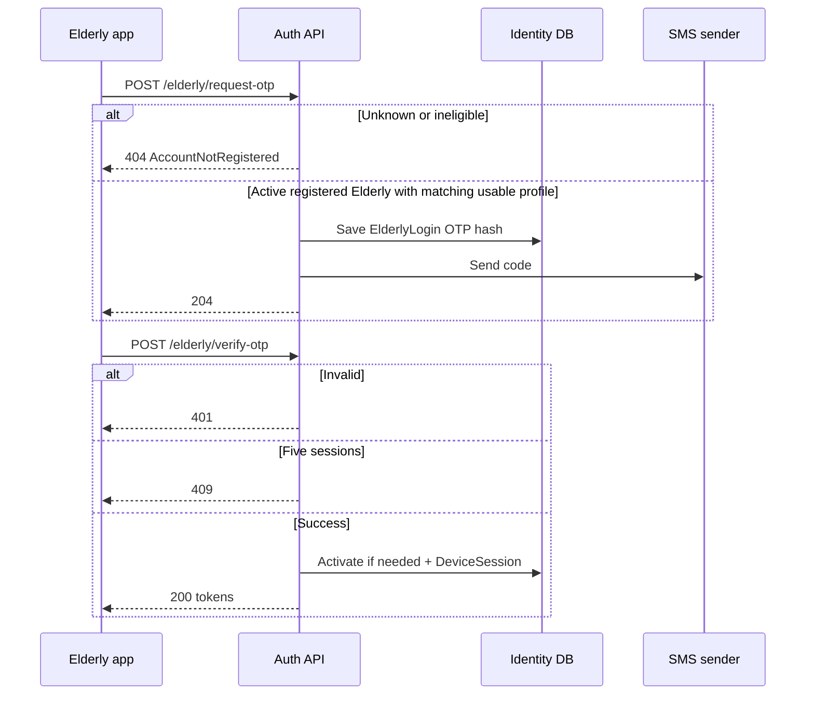

# Elderly SMS login

Elderly login is phone + SMS OTP only.

No password. No required email. Unknown numbers cannot self-register.

Development base URL:

```text
https://localhost:7296
```

The eligible request-OTP example below dispatches an OTP. Run it only against a local Development API configured with the no-op SMS sender. With SMS Misr configured, it can send a real SMS.

## Flow

```text
Family creates the Elderly user
    ↓
POST /api/v1/auth/elderly/request-otp
    ↓
POST /api/v1/auth/elderly/verify-otp
    ↓
Normal access + refresh + DeviceSession
```


```mermaid
sequenceDiagram
    participant App as Elderly app
    participant API as Auth API
    participant DB as Identity DB
    participant Sms as SMS sender

    App->>API: POST /elderly/request-otp
    alt Unknown or ineligible
        API-->>App: 404 AccountNotRegistered
    else Active registered Elderly with matching usable profile
        API->>DB: Save ElderlyLogin OTP hash
        API->>Sms: Send code
        API-->>App: 204
    end

    App->>API: POST /elderly/verify-otp
    alt Invalid
        API-->>App: 401
    else Five sessions
        API-->>App: 409
    else Success
        API->>DB: Activate if needed + DeviceSession
        API-->>App: 200 tokens
    end
```

## POST `/api/v1/auth/elderly/request-otp`

Anonymous. Success `204`. No response body. `204` means the phone belongs to an active registered Elderly account with a matching usable Elderly profile; the handler stores the OTP hash and dispatches the OTP through the configured SMS sender.

**This positive example dispatches an OTP. Run it only against a local Development API with the no-op SMS sender configured. Do not use it against a shared, staging, or production environment, or while SMS Misr credentials are configured.**

```bash
curl -sS -o /dev/null -w "%{http_code}\n" \
  https://localhost:7296/api/v1/auth/elderly/request-otp \
  -H "Content-Type: application/json" \
  -d '{
    "phoneNumber": "+201001234567"
  }'
```

Phone must be exact ASCII E.164: `+[1-9][0-9]{1,14}`.

Eligibility and outcomes:

- `204`: active Elderly account, Elderly is the user's only account type, and a matching usable Elderly profile exists.
- `404`: unknown phone and every other ineligible account, including PendingVerification, inactive, blocked, suspended, wrong account type, or missing/mismatched/unusable Elderly profile. All use the same code and detail.
- `400`: invalid phone format.
- The 60-second resend cooldown applies to eligible requests; after the cooldown, a new request replaces the previous pending OTP.
- Family must create and link the Elderly user first.

| HTTP | `code` | `detail` |
|---|---|---|
| 204 | — | No response body |
| 400 | `Api.Validation.Failed` | One or more validation errors occurred. |
| 404 | `Identity.ElderlyLogin.AccountNotRegistered` | Elderly account not registered. |

## POST `/api/v1/auth/elderly/verify-otp`

Anonymous. Success `200`. Same response shape as email or phone/password login.

```bash
curl -sS https://localhost:7296/api/v1/auth/elderly/verify-otp \
  -H "Content-Type: application/json" \
  -d '{
    "phoneNumber": "+201001234567",
    "code": "123456",
    "deviceName": "iPhone",
    "devicePlatform": 2,
    "appVersion": "1.0.0"
  }'
```

`code` must be exactly six ASCII digits.

Rules:

- First valid OTP verifies the phone and activates a PendingVerification Elderly user
- Session-limit check runs before the OTP is consumed
- If the limit is reached, the OTP request stays Pending
- Successful Elderly login is always Normal access
- An Elderly user cannot have another account type on the same identity
- Invalid, expired, unknown, and ineligible attempts use one generic error

| HTTP | `code` |
|---|---|
| 401 | `Identity.ElderlyLogin.OtpVerificationFailed` |
| 409 | `Identity.ElderlyLogin.SessionLimitReached` |

An account rejected by request-OTP cannot complete a login flow. In particular, PendingVerification Elderly accounts are not eligible.

## Elderly accounts are family-provisioned

Elderly identities are not self-registered. They are created server-side when a family adds a dependent (`POST /api/v1/family/dependents`, see `docs/app/families/dependents.md`): the Identity user is created with no email and no password, `status = Active`, and phone already verified, so the very first SMS OTP request/verify cycle logs them in immediately. Removing a dependent does **not** delete the Identity user — the person keeps logging in by phone OTP and can be re-linked to a family.

## Local SMS

For a test sender, do **not** set a template:

```bash
export Identity__Sms__SmsMisr__Username="REPLACE_ME"
export Identity__Sms__SmsMisr__Password="REPLACE_ME"
export Identity__Sms__SmsMisr__Sender="REPLACE_ME"
export Identity__Sms__SmsMisr__Environment="2"
```

That uses `POST /api/SMS/`. Set `Identity__Sms__SmsMisr__Template` only after SMS Misr gives you an approved OTP template.
