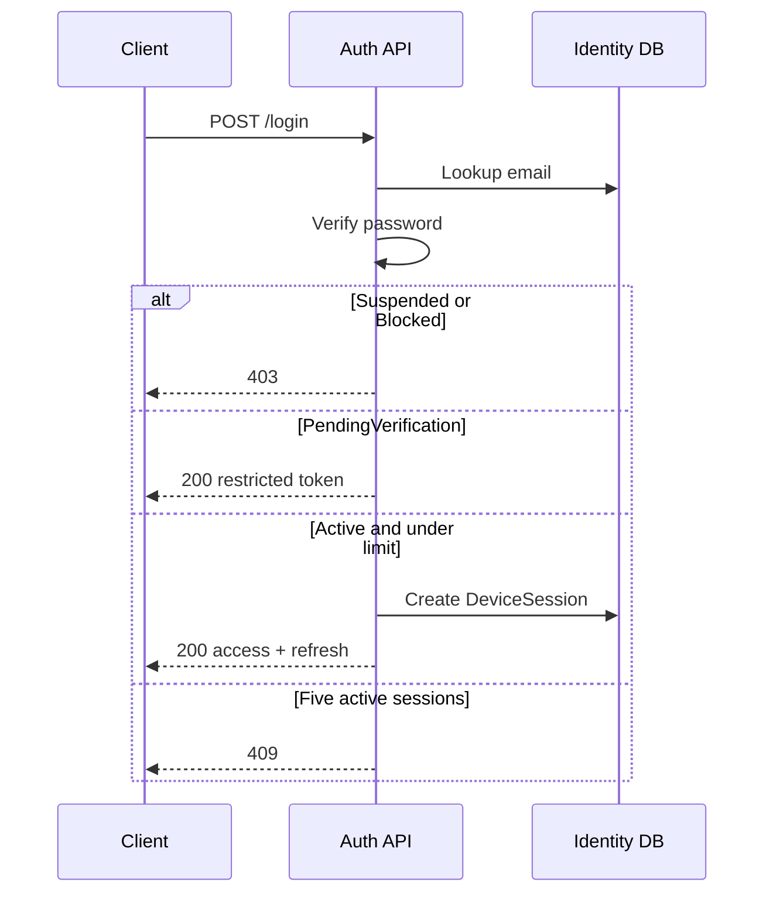

# Email/password login

Family and Caregiver login.

The identifier is **email only**. Do not send a phone number as the login name.

Development base URL:

```text
https://localhost:7296
```

## Flow

```text
POST /api/v1/auth/login
    ↓
PendingVerification → restricted JWT, no refresh
Active             → access + refresh + DeviceSession
Suspended/Blocked  → 403
Five active sessions → 409
```



## POST `/api/v1/auth/login`

Anonymous. Success `200`.

```bash
curl -sS https://localhost:7296/api/v1/auth/login \
  -H "Content-Type: application/json" \
  -d '{
    "email": "user@example.com",
    "password": "Password1234",
    "deviceName": "Pixel 8",
    "devicePlatform": 1,
    "appVersion": "1.0.0"
  }'
```

`devicePlatform`:

| Value | Platform |
|---|---|
| `0` | Unknown |
| `1` | Android |
| `2` | iOS |
| `3` | Web |

JSON `accessType` is `1` (Normal) or `2` (RestrictedVerification). The JWT claim `access_type` is `Normal` or `RestrictedVerification`.

PendingVerification response:

```json
{
  "userId": "018f0000-0000-0000-0000-000000000000",
  "accessType": 2,
  "accessToken": "eyJ...",
  "accessTokenExpiresOnUtc": "2026-08-25T12:15:00Z",
  "refreshToken": null,
  "refreshTokenExpiresOnUtc": null,
  "deviceSessionId": null,
  "emailVerified": false,
  "phoneVerified": true
}
```

Active response:

```json
{
  "userId": "018f0000-0000-0000-0000-000000000000",
  "accessType": 1,
  "accessToken": "eyJ...",
  "accessTokenExpiresOnUtc": "2026-08-25T12:15:00Z",
  "refreshToken": "opaque-refresh-token",
  "refreshTokenExpiresOnUtc": "2026-09-24T12:00:00Z",
  "deviceSessionId": "018f0000-0000-0000-0000-000000000010",
  "emailVerified": true,
  "phoneVerified": true
}
```

Store `deviceSessionId`. Current-session logout needs it in `X-Device-Session-Id`. Refresh needs it in the body.

## Rules

- Unknown email and wrong password return the same error
- Restricted token lasts 15 minutes
- Restricted token cannot call password change or session endpoints
- Normal access lasts 15 minutes
- Refresh/device session lasts 30 days
- Maximum five active DeviceSessions
- The API does not silently drop an old session
- A password rehash does not revoke sessions
- Successful login updates last-login time

| HTTP | `code` |
|---|---|
| 401 | `Identity.Login.InvalidCredentials` |
| 403 | `Identity.Login.UserSuspended` |
| 403 | `Identity.Login.UserBlocked` |
| 409 | `Identity.Login.SessionLimitReached` |

Use the access token as:

```text
Authorization: Bearer <accessToken>
```
