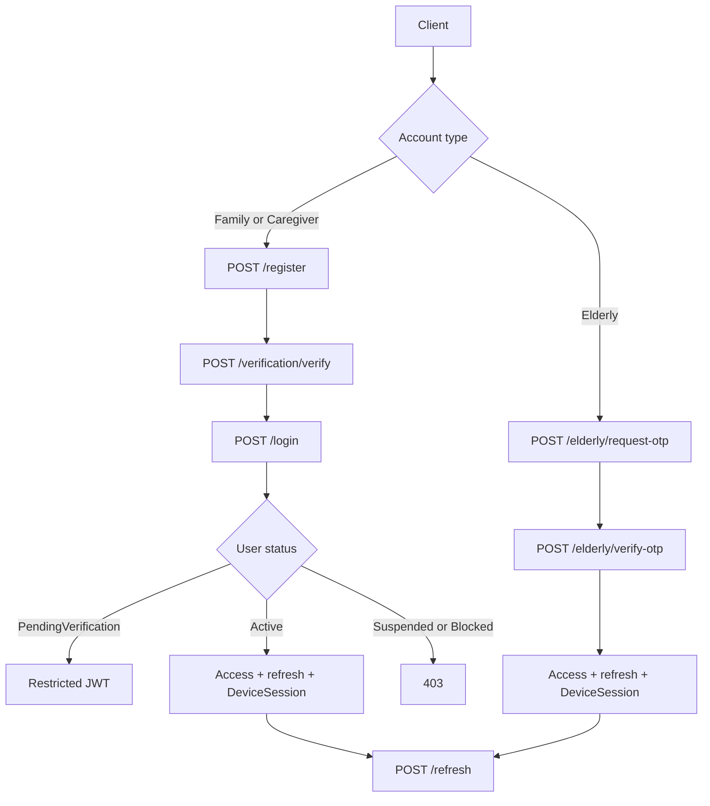

# Authentication overview

Sanad Auth is the Identity vertical slice exposed by `AuthController` at `/api/v1/auth`.

Google/Apple social authentication was cancelled and removed. Do not add social endpoints.

Development base URL:

```text
https://localhost:7296
```

Swagger UI: `https://localhost:7296/swagger`  
OpenAPI: `https://localhost:7296/openapi/v1.json`

## Actors

| Actor | Credential | Registration |
|---|---|---|
| Family | Email + password | Self-register, then verify email and phone |
| Medical Caregiver | Email + password | Self-register, then verify email and phone |
| Companion Caregiver | Email + password | Self-register, then verify email and phone |
| Elderly | Phone + SMS OTP only | Cannot self-register. Family creates/links the user first |

## Token model

| Token | Lifetime | Purpose |
|---|---|---|
| Restricted access JWT | 15 minutes | Incomplete verification only |
| Normal access JWT | 15 minutes | Application access |
| Refresh token | 30 days | Rotate a DeviceSession |

JSON `accessType` is the enum value: `1` = Normal, `2` = RestrictedVerification.

The JWT claim `access_type` is the enum name: `Normal` or `RestrictedVerification`.

Restricted tokens have no refresh token and no DeviceSession. They cannot call password-change or session endpoints.

Maximum five active DeviceSessions per user. The API does not silently revoke an old session.

## OTP policy

```text
6 ASCII digits
5-minute lifetime
60-second resend cooldown
Maximum 5 failed attempts
Hash-only storage
```

Phone numbers on the wire must be exact ASCII E.164: `+[1-9][0-9]{1,14}`.

## Delivery

Handlers persist OTP hashes first, then call `IEmailSender` / `ISmsSender`.

- Unconfigured SMTP or SMS Misr → development no-op senders. The API never returns the raw code.
- SMTP configured → bilingual email.
- SMS Misr username + password + sender, no template → `POST /api/SMS/`.
- SMS Misr template set → `POST /api/OTP/`.

## Flows



Detailed documents:

- [Registration and verification](registration-and-verification.md)
- [Email/password login](email-password-login.md)
- [Elderly SMS login](elderly-sms-login.md)
- [Refresh and sessions](refresh-and-sessions.md)
- [Password reset and change](password-reset-and-change.md)
- [Claims and policies](claims-and-policies.md)
- [Error catalog](errors.md)

## Endpoint map

| Method | Path | Access |
|---|---|---|
| POST | `/api/v1/auth/register` | Anonymous |
| POST | `/api/v1/auth/verification/verify` | Anonymous |
| POST | `/api/v1/auth/verification/resend` | Anonymous |
| POST | `/api/v1/auth/login` | Anonymous |
| POST | `/api/v1/auth/refresh` | Anonymous |
| POST | `/api/v1/auth/elderly/request-otp` | Anonymous |
| POST | `/api/v1/auth/elderly/verify-otp` | Anonymous |
| POST | `/api/v1/auth/password/reset/request` | Anonymous |
| POST | `/api/v1/auth/password/reset` | Anonymous |
| POST | `/api/v1/auth/password/change` | Normal JWT |
| POST | `/api/v1/auth/sessions/logout` | Normal JWT + `X-Device-Session-Id` |
| POST | `/api/v1/auth/sessions/logout-all` | Normal JWT |
| GET | `/api/v1/auth/sessions` | Normal JWT |
| DELETE | `/api/v1/auth/sessions/{sessionId}` | Normal JWT |
