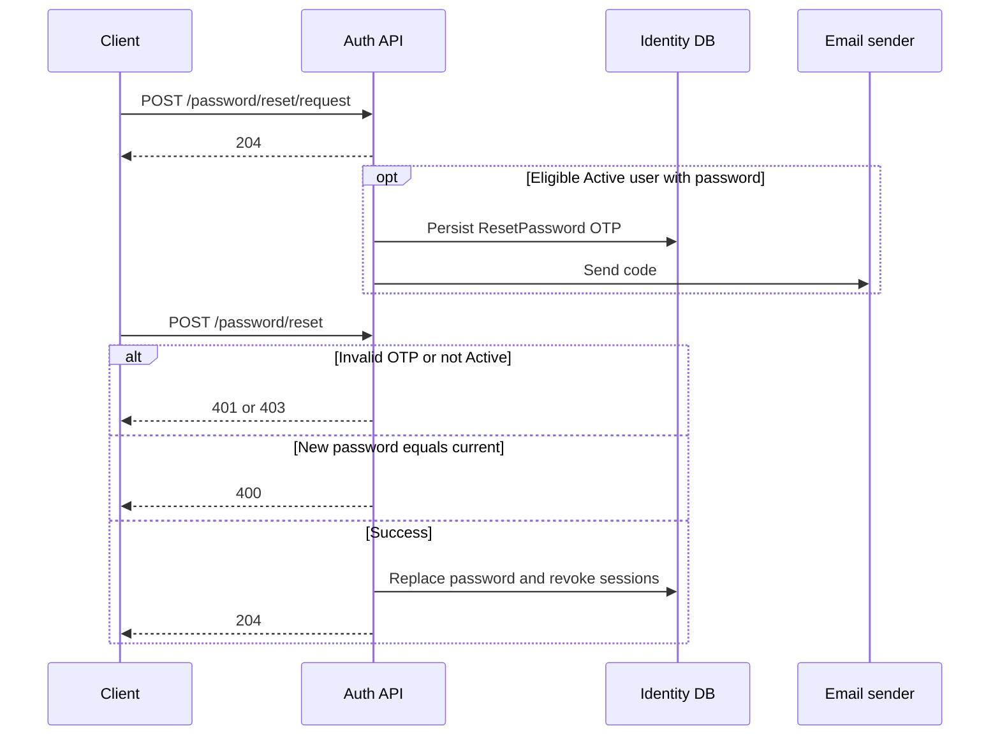

# Password reset and change

Reset is email OTP for Active users who already have a password. Change is for a logged-in user with a Normal token.

Development base URL:

```text
https://localhost:7296
```

## Reset flow

```text
POST /api/v1/auth/password/reset/request
    ↓
User receives email OTP, or nothing if SMTP is not configured
    ↓
POST /api/v1/auth/password/reset
    ↓
Password replaced and every DeviceSession revoked
```



## POST `/api/v1/auth/password/reset/request`

Anonymous. Always `204`. This must not reveal whether the email exists.

```bash
curl -sS -o /dev/null -w "%{http_code}\n" \
  https://localhost:7296/api/v1/auth/password/reset/request \
  -H "Content-Type: application/json" \
  -d '{
    "email": "user@example.com"
  }'
```

Rules:

- Unknown, passwordless, and non-Active users still get `204`
- Eligible users get an email OTP after the request is saved
- 60-second silent cooldown
- At 60 seconds the previous pending request is replaced
- OTP policy: six digits, five minutes, five attempts

## POST `/api/v1/auth/password/reset`

Anonymous. Success `204`.

```bash
curl -sS -o /dev/null -w "%{http_code}\n" \
  https://localhost:7296/api/v1/auth/password/reset \
  -H "Content-Type: application/json" \
  -d '{
    "email": "user@example.com",
    "otpCode": "123456",
    "newPassword": "NewPassword1234"
  }'
```

`otpCode` must be exactly six ASCII digits. New password follows the same 10–128 / upper / lower / number policy.

Rules:

- The user must still be Active when reset runs
- New password must differ from the current password
- Success revokes every DeviceSession
- Failed reset does not change the password, OTP, or sessions

| HTTP | `code` |
|---|---|
| 401 | `Identity.Password.UserNotFound` |
| 403 | `Identity.Password.UserNotActive` |
| 400 | `Identity.Password.UserHasNoPassword` |
| 401 | `Identity.Password.OtpVerificationFailed` |
| 401 | `Identity.Password.PendingRequestNotFound` |
| 400 | `Identity.Password.NewPasswordMustDiffer` |

## POST `/api/v1/auth/password/change`

Normal JWT. Success `204`. Restricted tokens receive `403`.

```bash
curl -sS -o /dev/null -w "%{http_code}\n" \
  https://localhost:7296/api/v1/auth/password/change \
  -H "Authorization: Bearer ACCESS_TOKEN" \
  -H "Content-Type: application/json" \
  -d '{
    "currentPassword": "Password1234",
    "newPassword": "NewPassword1234"
  }'
```

Rules:

- Current password must be correct
- New password must differ from the current password
- Success revokes every DeviceSession, including the current one
- The client must log in again

| HTTP | `code` |
|---|---|
| 401 | `Identity.Password.InvalidCurrentPassword` |
| 400 | `Identity.Password.NewPasswordMustDiffer` |
| 404 | `Identity.Password.UserNotFound` |
