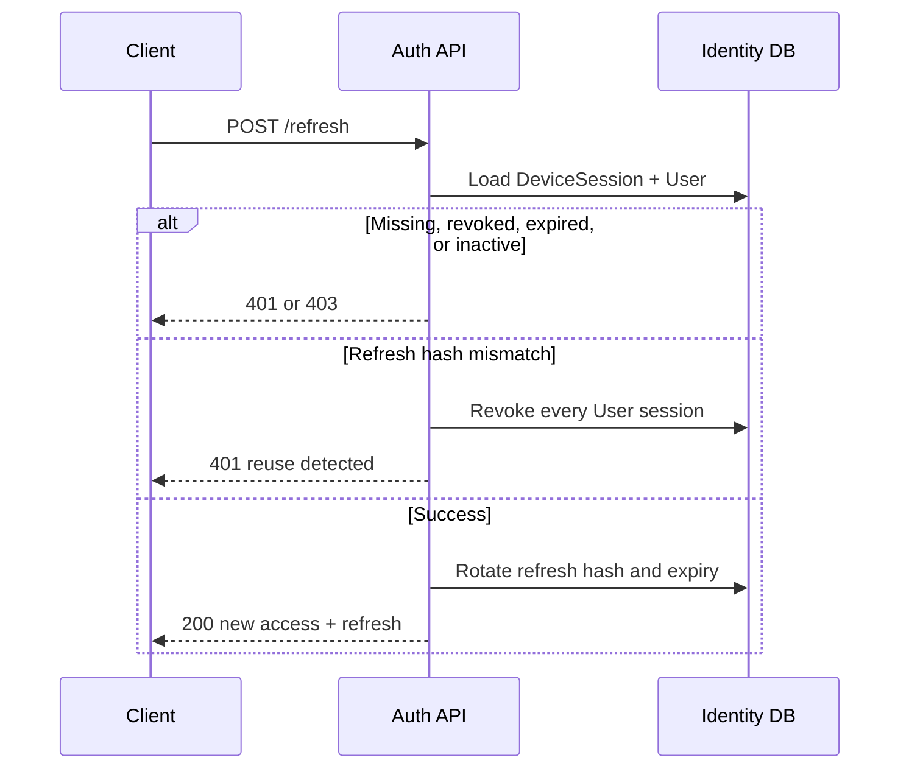

# Refresh and sessions

Active users receive a DeviceSession plus an opaque refresh token. Restricted verification tokens have neither.

Development base URL:

```text
https://localhost:7296
```

Use the access token as:

```text
Authorization: Bearer <accessToken>
```

Current-session logout also needs:

```text
X-Device-Session-Id: <deviceSessionId>
```

## Refresh flow



## POST `/api/v1/auth/refresh`

Anonymous. Success `200`. Send the session id and the current refresh token. Do not send the access token.

```bash
curl -sS https://localhost:7296/api/v1/auth/refresh \
  -H "Content-Type: application/json" \
  -d '{
    "deviceSessionId": "018f0000-0000-0000-0000-000000000010",
    "refreshToken": "opaque-refresh-token"
  }'
```

```json
{
  "deviceSessionId": "018f0000-0000-0000-0000-000000000010",
  "accessToken": "eyJ...",
  "accessTokenExpiresOnUtc": "2026-08-25T12:15:00Z",
  "refreshToken": "new-opaque-refresh-token",
  "refreshTokenExpiresOnUtc": "2026-09-24T12:00:00Z"
}
```

Rules:

- Replace the stored refresh token after every success
- Reuse of an old refresh token revokes every session for that user
- Only Active users can refresh
- Access token is 15 minutes
- Refresh/device session is 30 days

| HTTP | `code` |
|---|---|
| 401 | `Identity.Refresh.SessionNotFound` |
| 401 | `Identity.Refresh.SessionRevoked` |
| 401 | `Identity.Refresh.SessionExpired` |
| 401 | `Identity.Refresh.UserNotFound` |
| 403 | `Identity.Refresh.UserNotActive` |
| 401 | `Identity.Refresh.ReuseDetected` |

## GET `/api/v1/auth/sessions`

Normal JWT. Success `200`.

```bash
curl -sS https://localhost:7296/api/v1/auth/sessions \
  -H "Authorization: Bearer ACCESS_TOKEN"
```

Returns non-revoked, non-expired sessions with device name, platform, app version, created, expiry, and last rotation. No token hashes.

## POST `/api/v1/auth/sessions/logout`

Normal JWT plus `X-Device-Session-Id`. Success `204`.

```bash
curl -sS -o /dev/null -w "%{http_code}\n" \
  https://localhost:7296/api/v1/auth/sessions/logout \
  -H "Authorization: Bearer ACCESS_TOKEN" \
  -H "X-Device-Session-Id: 018f0000-0000-0000-0000-000000000010" \
  -X POST
```

A missing or invalid header returns `400` with `Api.Auth.InvalidDeviceSessionHeader`.

## POST `/api/v1/auth/sessions/logout-all`

Normal JWT. Success `204`.

Revokes every non-revoked session for the current user.

## DELETE `/api/v1/auth/sessions/{sessionId}`

Normal JWT. Success `204`.

Revokes one owned session. A foreign or missing session returns `404` so ownership is not leaked.

| HTTP | `code` |
|---|---|
| 404 | `Identity.Sessions.SessionNotFound` |
| 404 | `Identity.Sessions.SessionNotOwned` |
| 404 | `Identity.Sessions.UserNotFound` |

Revocation is idempotent. Maximum five active sessions. The user must remove an old session; the API does not pick one.
