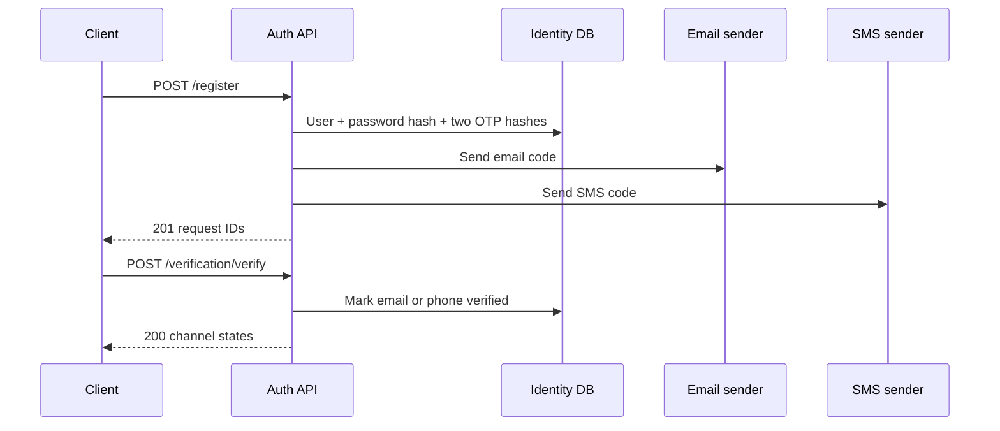

# Registration and verification

This flow is for Family, Medical Caregiver, and Companion Caregiver.

Elderly cannot register here. Family must create the Elderly user first, then the Elderly app uses SMS login.

Development base URL:

```text
https://localhost:7296
```

The API never returns the raw OTP. If SMTP or SMS Misr is not configured, development senders complete without delivering a message.

## Flow

```text
POST /api/v1/auth/register
    ↓
POST /api/v1/auth/verification/verify   (email request)
POST /api/v1/auth/verification/verify   (phone request)
    ↓
POST /api/v1/auth/login
```

Resend, if needed, after 60 seconds:

```text
POST /api/v1/auth/verification/resend
```



## POST `/api/v1/auth/register`

Anonymous. Success `201`.

```bash
curl -sS https://localhost:7296/api/v1/auth/register \
  -H "Content-Type: application/json" \
  -d '{
    "arabicFullName": "محمد أحمد",
    "englishFullName": "Mohamed Ahmed",
    "email": "user@example.com",
    "phoneNumber": "+201001234567",
    "password": "Password1234",
    "accountType": 1,
    "avatarUrl": null
  }'
```

`accountType`:

| Value | Role |
|---|---|
| `1` | Family |
| `2` | Medical Caregiver |
| `3` | Companion Caregiver |
| `4` | Elderly — rejected |

Success:

```json
{
  "userId": "018f0000-0000-0000-0000-000000000000",
  "emailVerificationRequestId": "018f0000-0000-0000-0000-000000000001",
  "phoneVerificationRequestId": "018f0000-0000-0000-0000-000000000002"
}
```

Keep both verification request IDs. Verify uses them, not the email or phone.

Rules:

- Email and phone must be unique
- Phone must be exact ASCII E.164: `+[1-9][0-9]{1,14}`
- Password: 10–128 characters, uppercase, lowercase, and a number
- The handler saves first, then sends
- Unconfigured SMTP/SMS keeps the no-op senders

| HTTP | `code` |
|---|---|
| 400 | `Identity.Registration.UnsupportedAccountType` or validation |
| 409 | `Identity.Registration.EmailAlreadyInUse` |
| 409 | `Identity.Registration.PhoneAlreadyInUse` |

## POST `/api/v1/auth/verification/verify`

Anonymous. Success `200`.

```bash
curl -sS https://localhost:7296/api/v1/auth/verification/verify \
  -H "Content-Type: application/json" \
  -d '{
    "verificationRequestId": "018f0000-0000-0000-0000-000000000001",
    "code": "123456"
  }'
```

`code` must be exactly six ASCII digits.

The JSON property name is `attemptesRemaining` (current API spelling):

```json
{
  "userId": "018f0000-0000-0000-0000-000000000000",
  "emailVerified": true,
  "phoneVerified": false,
  "normalAccessAllowed": false,
  "attemptesRemaining": 4
}
```

Rules:

- Email and phone are separate requests
- The user becomes Active only after both channels are verified
- A wrong code increments attempts
- Five failed attempts invalidate the request
- An expired pending request is marked expired
- After both channels succeed, call login. PendingVerification login returns a restricted token

| HTTP | `code` |
|---|---|
| 401 | `Identity.Verification.RequestNotFound` |
| 400 | `Identity.Verification.RequestNotPending` |
| 401 | `Identity.Verification.RequestExpired` |
| 401 | `Identity.Verification.InvalidCode` |
| 400 | `Identity.Verification.UnsupportedPurpose` |
| 401 | `Identity.Verification.UserNotFound` |

## POST `/api/v1/auth/verification/resend`

Anonymous. Success `200`.

```bash
curl -sS https://localhost:7296/api/v1/auth/verification/resend \
  -H "Content-Type: application/json" \
  -d '{
    "verificationRequestId": "018f0000-0000-0000-0000-000000000001"
  }'
```

```json
{
  "verificationRequestId": "018f0000-0000-0000-0000-000000000003",
  "expiresOnUtc": "2026-08-25T12:05:00Z"
}
```

Rules:

- 60-second cooldown from the current request creation time
- At 60 seconds the old request is invalidated and replaced
- Replacement keeps the same user, target, channel, and purpose
- New expiry is five minutes
- Verify the **new** request ID

| HTTP | `code` |
|---|---|
| 404 | `Identity.Verification.ResendRequestNotFound` |
| 400 | `Identity.Verification.ResendRequestNotPending` |
| 409 | `Identity.Verification.RequestSuperseded` |
| 409 | `Identity.Verification.ResendCooldownActive` |

## Local delivery

| Config | What happens |
|---|---|
| No SMTP / no SMS Misr | Codes are stored as hashes only |
| SMTP `Host` + `FromAddress` | Bilingual email is sent |
| SMS Misr username + password + sender, no template | `POST https://smsmisr.com/api/SMS/` |
| SMS Misr template set | `POST https://smsmisr.com/api/OTP/` |

Do not commit provider secrets. Use environment variables only.
